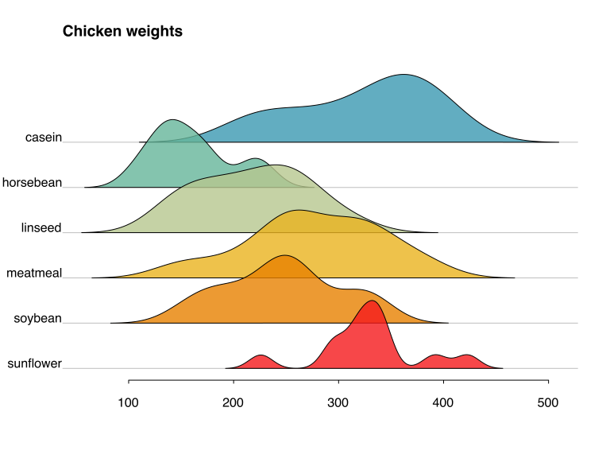

# R base plotting without wrappers #

Base plotting is as old as R itself yet for most users it remains mysterious.
They might be using `plot()` or even know the full list of its parameters but most never understand it fully.
This article attempts to demystify base graphics by providing a friendly introduction for the uninitiated.


## Deconstructing a plot ##

Quickly after learning R users start producing various figures by calling `plot()`, `hist()`, or `barplot()`.
Then, when faced with a complicated figure, they start stacking those plots on top of one another using various hacks, like `add=TRUE`, `ann=FALSE`, `cex=0`.
For most this marks the end of their base plotting journey and they leave with an impression of it being an ad-hoc bag of tricks that has to be learned and remembered but that otherwise is hard, inconsistent, and unintuitive.
Nowadays even experts who write about base graphics[^jeffleek] or compare it with other systems[^davidrobinson] share the same opinion.
However, those initial functions everyone was using are only wrappers on top of the smaller functions that do all the work.
And many would be surprised to learn that under the hood base plotting follows the paradigm of having a set of small functions that each do one thing and work well with one another.

Let's start with the simplest example.

```
plot(0:10, 0:10, xlab = "x-axis", ylab = "y-axis", main = "my plot")
```


The `plot()` function above is really just a wrapper that calls an array of lower level functions.

```
plot.new()
plot.window(xlim = c(0,10), ylim = c(0,10))
points(0:10, 0:10)
axis(1)
axis(2)
box()
title(xlab = "x-axis")
title(ylab = "y-axis")
title(main = "my plot")
```

Written like this all the elements comprising the plot become clear.
Every new function call draws a single object on top of the plot produced up until that point.
It becomes easy to see which line should be modified in order to change something on the plot.
Just as an example let's modify the above plot by: 1) adding a grid, 2) removing the box around the plot, 3) removing the axis lines, 4) making axis labels bold, 5) turning the annotation labels red, and 6) shifting the title to the left.

```
plot.new()
plot.window(xlim = c(0,10), ylim = c(0,10))
grid()
points(0:10, 0:10)
axis(1, lwd = 0, font.axis=2)
axis(2, lwd = 0, font.axis=2)
title(xlab = "x-axis", col.lab = "red3")
title(ylab = "y-axis", col.lab = "red3")
title(main = "my plot", col.main = "red3", adj = 0)
```


In each case to achieve the wanted effect only a single line had to be modified.
And the function names are very intuitive.
A person without any R experience would have no trouble saying which element on the plot is added by which line or changing some of the parameters.

So, in order to construct a plot various functions are called one by one.
But where do we get all the names for those functions?
Do we need to remember hundreds of them?
Turns out the set of all the things you might need to do on a plot is pretty limited.

```
par()          # specifies various plot parameters
plot.new()     # starts a new plot
plot.window()  # adds a coordinate system to the plot region

points()       # draws points
lines()        # draws lines connecting 2 points
abline()       # draws infinite lines throughout the plot
arrows()       # draws arrows
segments()     # draws segmented lines
rect()         # draws rectangles
polygon()      # draws complex polygons

text()         # adds written text within the plot
mtext()        # adds text in the margins of a plot

title()        # adds plot and axis annotations
axis()         # adds axes
box()          # draws a box around a plot
grid()         # adds a grid over a coordinate system
legend()       # adds a legend
```

The above list covers majority of the functionality needed to recreate almost any plot.
And for demonstration `example()` can be used to quickly see what each of those functions do, i.e. `example(rect)`.
R also has some other helpful functions like `rug()` and `jitter()` to make certain situations easier but they are not crucial and can be implemented using the ones listed above.

Function names are quite straightforward but what about their arguments?
Indeed some of argument names, like `cex` can seem quite cryptic.
But the argument name is always an abbreviation for a property of the plot[^parameters].
For example `col` is a shorthand for "color", `lwd` stands for "line-width", and `cex` means "character expansion".
Good news is that in general the same arguments stand for the same properties across all of base R functions.
And for a specific function `help()` can always be used in order to get the list of all arguments and their descriptions.

To further illustrate the consistency between arguments let's return to the first example.
By now it should be pretty clear, with one exception - the `axis(1)` and `axis(2)` lines.
Where do those numbers: `1` and `2` came from?
The numbers specify the positions around the plot and they start from `1` which refers to the bottom of the plot and go clockwise up to `4` which refers to the right side.
The picture below demonstrates the relationship between numbers and four sides of the plot.

```
plot.new()
box()
mtext("1", side = 1, col = "red3")
mtext("2", side = 2, col = "red3")
mtext("3", side = 3, col = "red3")
mtext("4", side = 4, col = "red3")
```


The same position numbers are used throughout the various different functions.
Whenever a parameter of some function needs to specify a side, chances are it will do so using the numeric notation described above.
Below are a few examples.

```
par(mar = c(0,0,4,4))        # margins of a plot: c(bottom, left, right , top)
par(oma = c(1,1,1,1))        # outer margins of a plot
axis(3)                      # side where axis will be displayed
text(x, y, "text", pos = 3)  # pos selects the side the "text" is displayed at
mtext("text", side = 4)      # side specifies the margin "text" will appear in
```

Another important point is vectorization.
Almost all the arguments for base plotting functions are vectorized.
For example, when plotting rectangles the user does not have to add each point of each rectangle one by one within a loop.
Instead he or she can draw all the related objects with one function call while at the same time specifying different positions and parameters for each.

```
plot.new()
plot.window(xlim = c(0,3), ylim = c(0,3))

rect(xleft = c(0,1,2), ybottom = c(0,1,2), xright = c(1,2,3), ytop = c(1,2,3),
     border = c("pink","red","darkred"), lwd = 10
     )
```


Here is another example producing a check board pattern.

```
plot.new()
plot.window(xlim = c(0,10), ylim = c(0,10))

xs <- rep(1:9, each = 9)
ys <- rep(1:9)

rect(xs-0.5, ys-0.5, xs+0.5, ys+0.5, col = c("white","darkgrey"))
```


## Constructing a plot ##

One of base R graphics strengths is it's flexibility and potential for customization.
It really shines when the user needs to follow a particular style found in an existing example or a template[^stackoverflow].
Below are a few illustrations demonstrating how different base functions can work together and reconstruct various types of common figures from scratch.


- Annotated barplot of USA population growth over time.

    ```
    x <- time(uspop)
    y <- uspop

    plot.new()
    plot.window(xlim = range(x), ylim = range(pretty(y)))

    rect(x-4, 0, x+4, y)
    text(x, y, y, pos = 3, col = "red3", cex = 0.7)

    mtext(x, 1, at = x, las = 2, cex = 0.7, font = 2)
    axis(2, lwd = 0, las = 2, cex.axis = 0.7, font.axis = 2)
    title("US population growth", adj = 0, col.main = "red2")
    ```

    

    In this case for each rectangle four sets of points had to be specified: x and y for the left bottom corner plus x and y for the top right corner.
    In the end, even so this is a more complicated example, we still added all the different pieces of information using single function calls to `rect()`, `text()`, and `mtext()`.


- Parallel coordinates plot using the "iris" dataset.

    ```
    palette(c("cornflowerblue", "red3", "orange"))

    plot.new()
    plot.window(xlim = c(1,4), ylim = range(iris[,-5]))
    grid(nx = NA, ny = NULL)
    abline(v = 1:4, col = "grey", lwd = 5, lty = "dotted")

    matlines(t(iris[,-5]), col = iris$Species, lty = 1)

    axis(2, lwd = 0, las = 2)
    mtext(variable.names(iris)[-5], 3, at = 1:4, line = 1, col = "darkgrey")

    legend(x = 1, y = 2, legend = unique(iris$Species), col = unique(iris$Species),
           lwd = 3, bty = 'n')
    ```

    

    In this example we used a special function `matlines()` that draws one line for each column in a matrix.
    We also did a few other things that were novel so far: changed the default numeric colors via `palette()`, and used factor levels for specifying the actual colors within `matlines()` and `legend()`.
    Changing palette allows us to customize the color scheme while passing factors for the color arguments guarantees that the same colors are consistently assigned to the same factor levels across all the different functions.


- Dot plot of death rates in Virginia in 1940.

    ```
    colors <- hcl.colors(5, "Zissou")
    ys     <- c(1.25, 2, 1.5, 2.25)

    plot.new()
    plot.window(xlim = range(0,VADeaths), ylim = c(1,2.75))

    abline(h = ys, col = "grey", lty = "dotted", lwd = 3)
    points(VADeaths, ys[col(VADeaths)], col = colors, pch = 19, cex = 2.5)
    text(0, ys, colnames(VADeaths), adj = c(0.25,-1), col = "lightslategrey")

    axis(1, lwd = 0, font = 2)
    title("deaths per 1000 in 1940 Virginia stratified by age, gender, and location")

    legend("top", legend = rownames(VADeaths), col = colors, pch = 19, horiz = TRUE,
           bty = "n", title = "age bins")
    ```

    

    In this graph the groups were stratified by gender, age, and location
    For each group the y-axis hights were chosen manually and `col()` function was used to repeat those heights for all numbers within the matrix.


- Dual coordinate plot using the "mtcars" dataset.

    ```
    par(mar = c(4,4,4,4))
    plot.new()

    plot.window(xlim = range(mtcars$disp), ylim = range(pretty(mtcars$mpg)))

    points(mtcars$disp, mtcars$mpg, col = "darkorange2", pch = 19, cex = 1.5)
    axis(2, col.axis = "darkorange2", lwd = 2, las = 2)
    mtext("miles per gallon", 2, col = "darkorange2", font = 2, line = 3)

    plot.window(xlim = range(mtcars$disp), ylim = range(pretty(mtcars$hp)))

    points(mtcars$disp, mtcars$hp, col = "forestgreen", pch = 19, cex = 1.5)
    axis(4, col.axis = "forestgreen", lwd = 2, las = 2)
    mtext("horse power", 4, col = "forestgreen", font = 2, line = 3)

    box()
    axis(1)
    mtext("displacement", 1, font = 2, line = 3)
    title("displacement VS mpg VS hp", adj = 0, cex.main = 1)
    ```

    

    Here we visualized two scatter plots, with different y-axes, on a single figure.
    The trick here is to change the coordinate system in the middle of the plot using `plot.window()`.
    But note that plots with double y-axes are frowned upon so do not take this example as a suggestion.


- Ridgeline Density Plot showing chicken weight distributions stratified by feed type.

    ```
    dens <- tapply(chickwts$weight, chickwts$feed, density)

    xs <- Map(getElement, dens, "x")
    ys <- Map(getElement, dens, "y")
    ys <- Map(function(x) (x-min(x)) / max(x-min(x)) * 1.5, ys)
    ys <- Map(`+`, ys, length(ys):1)

    plot.new()
    plot.window(xlim = range(xs), ylim = c(1,length(ys)+1.5))
    abline(h = length(ys):1, col = "grey")

    Map(polygon, xs, ys, col = hcl.colors(length(ys), "Zissou", alpha = 0.8))

    axis(1, tck = -0.01)
    mtext(names(dens), 2, at = length(ys):1, las = 2, padj = 0)
    title("Chicken weights", adj = 0, cex = 0.8)
    ```

    

    In this example majority of the work is done preparing the densities by transforming y values to a range of 0 - 1.5 and then adding a different offset for each feed type.
    To make the drawn densities overlap nicely we plot them starting from the topmost and going down.
    After that `Map()` and `polygon()` do all the work.


- Violin Plot of chicken weights versus feed type


    ```
    dens <- tapply(chickwts$weight, chickwts$feed, density)
    cols <- hcl.colors(length(dens), "Zissou")

    xs <- Map(getElement, dens, "y")
    ys <- Map(getElement, dens, "x")

    xs <- Map(c, xs, Map(rev, Map(`*`, -1, xs)))
    ys <- Map(c, ys, Map(rev, ys))

    xs <- Map(function(x) (x-min(x)) / max(x-min(x) * 1.1), xs)
    xs <- Map(`+`, xs, 1:length(xs))


    plot.new()
    plot.window(xlim = range(xs), ylim = range(ys))
    grid(nx = NA, ny = NULL, lwd = 2)

    Map(polygon, xs, ys, col = cols)

    axis(2, las = 1, lwd = 0)
    title("Chicken weight by feed type", font = 2)

    legend("top", legend = names(dens), fill = cols, ncol = 3, inset = c(0, 1),
           xpd = TRUE, bty = "n")
    ```

    

    Now the polygons are double sided, and so we need to mirror and duplicate the `xs` and `ys`.
    In the code above 5th and 6th lines do this job.
    After that the plotting is almost identical to the previous example.
    There is one additional trick[^legendinset] used on the legend where we use "inset" to push it over to the other side.


- Correlation matrix plot using variables from the "mtcars" dataset.

    ```
    cors <- cor(mtcars)
    cols <- hcl.colors(200, "RdBu")[round((cors+1)*100)]

    par(mar = c(5,5,0,0))
    plot.new()
    plot.window(xlim = c(0,ncol(cors)), ylim = c(0,ncol(cors)))

    rect(row(cors)-1, col(cors)-1, row(cors), col(cors))
    symbols(row(cors)-0.5, col(cors)-0.5, circles = as.numeric(abs(cors))/2,
            inches = FALSE, asp = 1, add = TRUE, bg = cols
            )

    mtext(rownames(cors), 1, at=1:ncol(cors)-0.5, las=2)
    mtext(colnames(cors), 2, at=1:nrow(cors)-0.5, las=2)
    ```

    

    Here second line assigns colors for each correlation value by transforming correlation from a range of -1:1 to 0:200.
    Then we used `rect()` function to get the grid and `symbols()` for adding circles with specified radii.
    The resulting figure is similar to the one implemented by `corrplot` library[^corrplot].


## Summary ##

R base plotting system has several polished and easy to use wrappers that are sometimes convenient but in the long run only confuse and hide things.
As a result most R users are never properly introduced to the real functions behind the base plotting paradigm and are left confused by many of its perceived idiosyncrasies.
However, if inspected properly, base plotting can become powerful, flexible, and intuitive.
Under the hood of all wrappers the heavy lifting is done by a small set of simple functions that work in tandem with one another.
Often a few lines of code is all it takes to produce an elegant and customized figure.


[^jeffleek]: ["Why I don't use ggplot2"](https://simplystatistics.org/2016/02/11/why-i-dont-use-ggplot2/) by Jeff Leek
[^davidrobinson]: ["Why I use ggplot2"](http://varianceexplained.org/r/why-I-use-ggplot2/) by David Robinson
[^parameters]: ["Graphics parameter mnemonics"](https://www.stat.auckland.ac.nz/~paul/R/parMemnonics.html) by Paul Murrell
[^stackoverflow]: ["Reproducing the style of a histogram plot in R"](https://stackoverflow.com/q/27934840/1953718) on stackoverflow.com
[^corrplot]: ["corrplot"](https://cran.r-project.org/web/packages/corrplot/index.html) package on CRAN
[^legendinset]: [answer about plotting the legend in the margins with base R](https://stackoverflow.com/a/49501243/1953718) on stackoverflow.com

